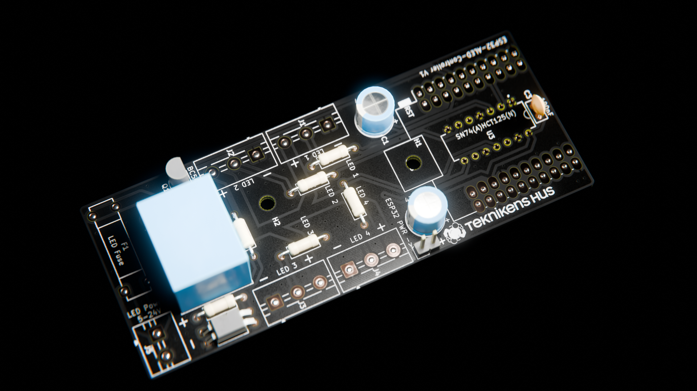

# ESP32 ALED Controller

A simple addressable LED strip controller based on the ESP32 D1 Mini development board.

## Summary

- **ESP32 D1 Mini** - Main microcontroller board
- **SN74AHCT125N** - 3.3V to 5V level shifter for LED data signal
- **Capacitors** - Power filtering capacitors for both 5V and 3.3V rails
- **4 Data outputs** - Drive 4 WS2811B or 2 APA102 LED strips (or other clock+data addressable LEDs)
- **Separate power input** - 5V-24V power input for the LED strips and 5V input for the ESP32 D1 Mini
- **Relay output** - Control a relay for switching power to the LED strips to reduce power consumption when LEDs are off
- **Glas fuse** - Protection for the LED input power line (Wise to add a external fuse per LED strip if powering multiple strips)

## Pinout
- LED 1 Data - GPIO18
- LED 2 Data - GPIO23
- LED 3 Data - GPIO21
- LED 4 Data - GPIO22
- Relay Control - GPIO14

## Additional LEDs
The additonal data outputs (2-3) are disabled by default. To enable them, cut the jumper traces on the bottom side of the PCB and bridge it to the opposite side.
## Data Resistors
Add data resistors for each data line. 33-200Ω is recommended. For the proper value, check the data line with an oscilloscope and try different resistors to find which provides the best square wave signal.
