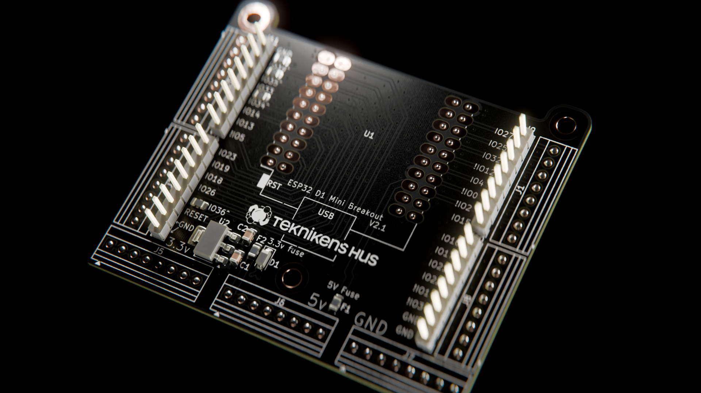

# ESP32 Breakout Board

## Overview

This is a breakout board for the ESP32 microcontroller, providing easy access to all GPIO pins and power connections.

## Features

- [ESP32 D1 Mini support](https://www.az-delivery.de/en/products/esp32-d1-mini-nodemcu-wifi-modul-esp-32-bluetooth-internet-entwicklungsboard-mit-usb-c-anschluss-kompatibel-mit-arduino-und-kompatibel-mit-wemos-d1-mini)
- Compact design
- Screw terminal and pin header connections
- Additional 3.3V regulator
- Fused power input for protection to the ESP32
- Optional pullups for pins that don't support internal pullups

## Hardware Files

PCB design files and schematics are included in this repository.
