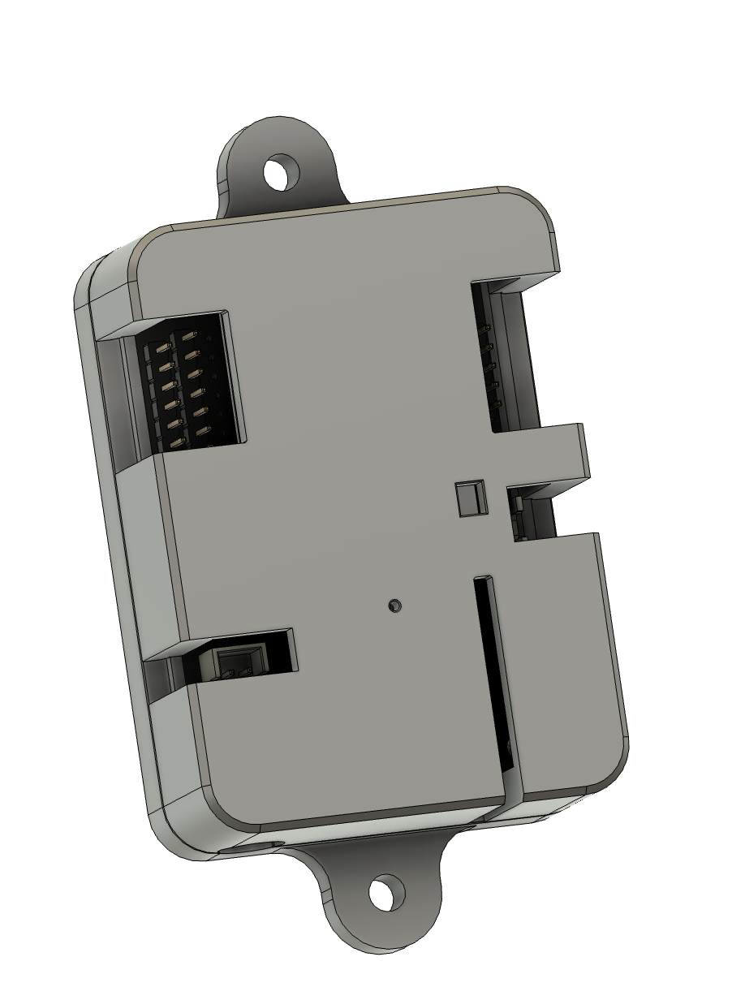

## ESP32-D1-Mini DF-Player Case
This is a simple 3D printed case for the ESP32-D1-Mini DF-Player PCB. It is designed to be printed in two parts, which can be easily assembled together. (hopefully with the correct tolerance).
- The PCB is screwed into the bottom part with 2 M3 BHCS, and the top is clipped on with 2 clips/bumps.
- The holes for all cables are slots so the top can be removed without disconnecting any cables.
- The back has a cutout so that the GPIO pinout on the silkscreen on the back of the PCB is visible.
- The bottom also has 2 holes for mounting the case to a surface.

# Printing
Orient the models so that the top is laying flat with the top down, and the bottom is laying flat with the top up.
No supports should be needed.