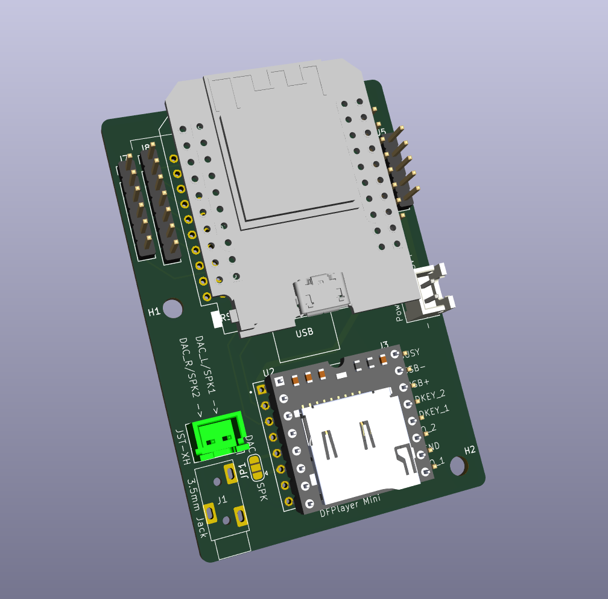

### ESP32-D1-Mini DF-Player

A simple PCB that connects a ESP32-D1 Mini together with a DFPlayer Mini using UART over GPIO13 and GPIO23.
- Audio output through a 3-pin headphone jack or JST-XH connector.
- DAC or SPK output can be chosen using JP1 and JP2 solder bridges.

## Components
- ESP32-D1 Mini
- DFPlayer Mini
- [3.5mm headphone jack](https://www.amazon.se/dp/B07KYBXP8R)
- JST-XH 2-pin connectors
- 2.54mm pin headers

## 3D printable case
A 3D printable case is available [3D-Print/README.md](./3D-Print/README.md)