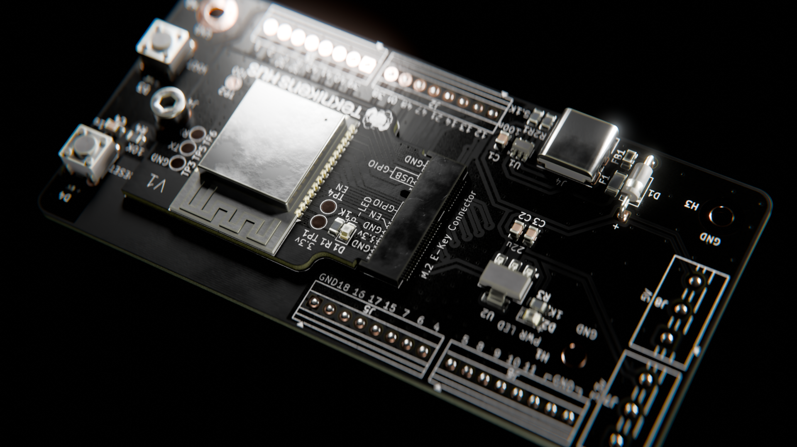

## ESP32 S3 M.2 Module and boards
The module is as simple as it gets, only decouple capacitors, pwr LED and probe points. The boards add power regulation and USB connectivity. Connection is handled with a M.2 E key slot.

## ESP32 M.2 (Simple Plus ESP-32 Module Breakout)
