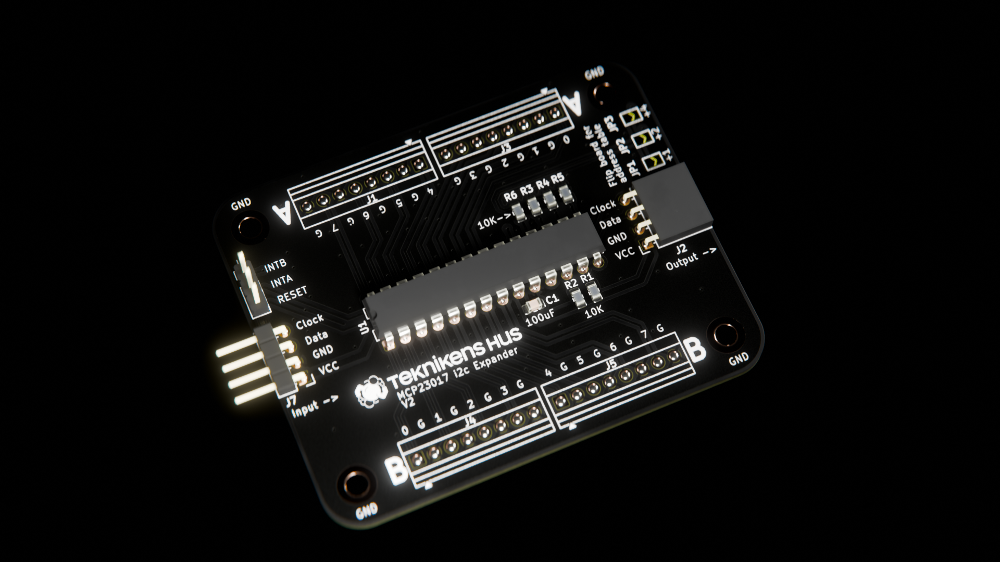

# MCP23017 i2c Expander

This is a simple i2c expander board based on the MCP23017 chip. It provides 16 additional GPIO pins via the i2c bus and can be chained together.

## Setting the i2c Address
There are 3 solder jumpers, J1, J2 and J3, that can be used to set the i2c address of the MCP23017 chip. The default address is 0x20 (all jumpers open). Closing the jumpers will add to the base address as follows:
- J1 closed: +1
- J2 closed: +2
- J3 closed: +4

For example, closing J1 and J3 will set the address to 0x25 (0x20 + 1 + 4).

## Components
- **1x MCP23017** - In DIP28 format
- **6x 10K Resistors** - SMD 0805
- **1x 100uF Capacitor** - SMD 0805
- **2x 4-pin headers/connectors** - For i2c and power connections (male and female for chaining)
- **8-pin screw terminals or 2.54mm headers** - For GPIO connections.
- **1x 3-pin header** - For reset and interrupt connections (optional)
